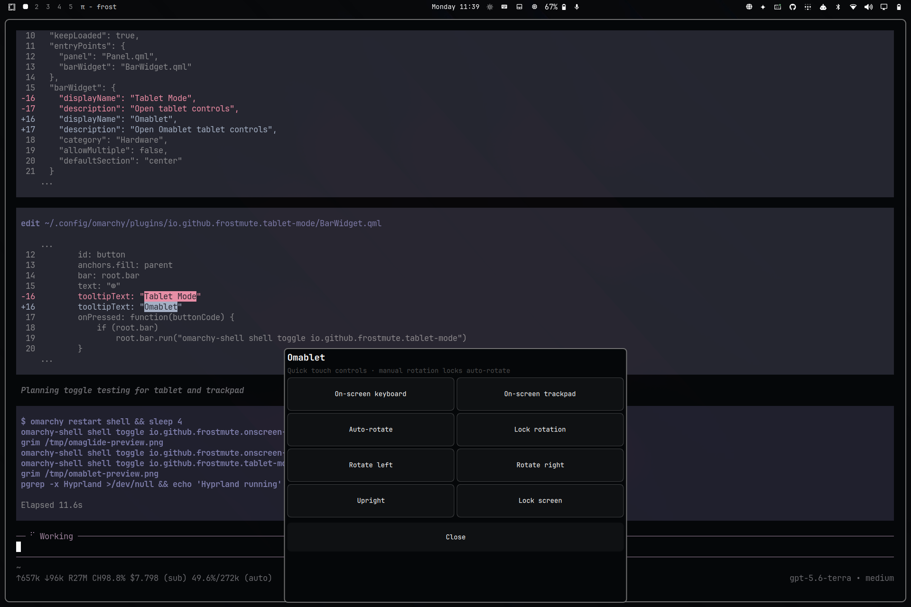

# Omablet for Omarchy



**Omablet** is a touch-first control panel for Omarchy tablets. It provides rotation and auto-rotate controls, access to **Omaqwerty** and **Omaglide**, and a lock-screen action.

## Install

```sh
omarchy plugin add https://github.com/frostmute/omarchy-omablet.git --enable
```

For automatic rotation, install and enable `iio-sensor-proxy`:

```sh
omarchy pkg add iio-sensor-proxy
systemctl --user enable --now iio-sensor-proxy
```

Omaqwerty and Omaglide are optional separate plugins.

## Remove

```sh
omarchy plugin remove io.github.frostmute.tablet-mode
```

## License

MIT
